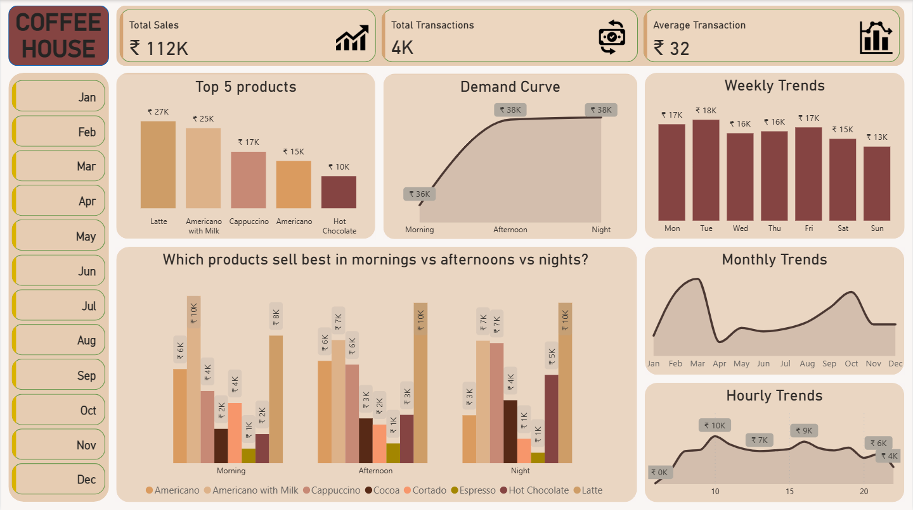
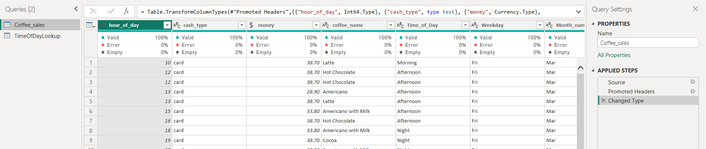
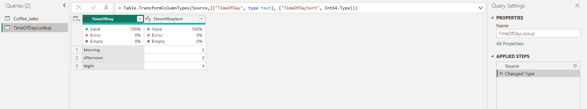
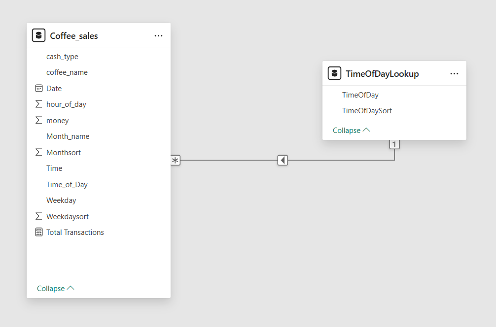

# Coffee House Sales Analysis - Power BI Dashboard

This repository contains the files and a detailed breakdown of the Coffee House Sales Dashboard project, created using Power BI.

### Interactive Dashboard Demo (GIF)

Below is a short demonstration of the dashboard's interactivity, showcasing dynamic filtering across different visuals.

---

### Project Overview

The primary goal of this project was to analyze sales data from a fictional coffee house to identify key trends and performance metrics. By creating an interactive and intuitive dashboard, the project aims to provide actionable insights that can help the business optimize its marketing strategies, manage inventory more effectively, and improve staffing schedules.

---

### Key Questions Answered

The dashboard was designed to answer critical business questions:
1.  **What are the key performance indicators?** (Total Sales: ₹112K, Total Transactions: 4K, Average Transaction Value: ₹32)
2.  **Which are the top 5 best-selling products?**
3.  **What are the peak sales periods?** (By hour, day of the week, and month)
4.  **How does the demand for products vary between morning, afternoon, and night?**
5.  **Which specific products should be promoted at different times of the day?**

---

### Technical Skills & Process

#### 1. Data Transformation (ETL)
The data was cleaned and transformed using **Power Query**. This involved handling two separate queries: one for the main sales data and another to create a custom lookup table.

**A. Main Table (`Coffee_sales`) Transformation:**
-   Corrected data types for all columns (e.g., `money` to Fixed Decimal, `date` to Date).
-   **Feature Engineering:** New columns were created from existing data to enhance analytical capabilities:
    -   `Time_of_Day`: Grouped hours into "Morning", "Afternoon", and "Night" using a conditional column.
    -   `Month_name` and `Weekday`: Extracted from the date column for trend analysis.

**B. Lookup Table (`TimeOfDayLookup`) Creation:**
-   To ensure the "Time of Day" slicers and visuals sorted logically (Morning -> Afternoon -> Night) instead of alphabetically, a separate lookup table was created.
-   This table was built from scratch within Power Query, containing the `TimeOfDay` names and a corresponding `TimeOfDaySort` column (1, 2, 3). This demonstrates an understanding of data modeling best practices.

#### 2. Data Modeling
A **Star Schema** data model was implemented to create a clean and efficient structure for analysis.
-   **`Coffee_sales` (Fact Table):** Contains all transactional data.
-   **`TimeOfDayLookup` (Dimension Table):** The custom-built table for proper sorting.
-   A **one-to-many relationship** was established between `TimeOfDayLookup` and `Coffee_sales` on the `Time_of_Day` column.

#### 3. DAX Calculations
Several key measures were created using DAX to power the dashboard's visuals:
-   **Total Sales:** `Total Sales = SUM(Coffee_sales[money])`
-   **Total Transactions:** `Total Transactions = COUNTROWS(Coffee_sales)`
-   **Average Transaction Value:** `Average Transaction = DIVIDE([Total Sales], [Total Transactions], 0)`

#### 4. Data Visualization & Insights
An intuitive dashboard was designed to present the findings clearly:
-   **KPI Cards:** Provide an immediate overview of the core business metrics.
-   **Trend Charts (Weekly, Monthly, Hourly):** The weekly trend shows that **Tuesday (₹18K)** is the busiest day, while sales dip on the weekend.
-   **Time-of-Day Analysis (Grouped Bar Chart):** This visual provides the most actionable insight:
    -   **Insight:** While **Latte** is the overall top seller, **Americano with Milk** is a very strong competitor specifically in the mornings. This presents an opportunity for a targeted "Morning Rush" promotion.

---

### Tools Used

-   **Power BI Desktop** (Data Modeling, DAX, Visualization)
-   **Power Query** (ETL - Data Cleaning and Transformation)
-   **DAX** (Data Analysis Expressions for measure creation)
